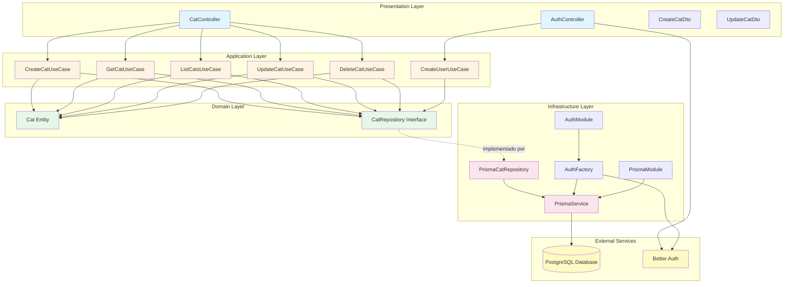

# Diagrama de Arquitetura - SOS Gatinhos API

## Arquitetura em Camadas (Clean Architecture)

## Descrição das Camadas

### 🎨 Presentation Layer
- **Responsabilidade**: Interface HTTP, validação de entrada, formatação de saída
- **Componentes**: Controllers, DTOs
- **Dependências**: Application Layer

### 💼 Application Layer
- **Responsabilidade**: Lógica de casos de uso, orquestração
- **Componentes**: Use Cases
- **Dependências**: Domain Layer

### 🏛️ Domain Layer
- **Responsabilidade**: Entidades de negócio, regras de domínio, interfaces
- **Componentes**: Entities, Repository Interfaces
- **Dependências**: Nenhuma (camada mais interna)

### 🔧 Infrastructure Layer
- **Responsabilidade**: Implementações técnicas, acesso a dados, serviços externos
- **Componentes**: Repositories, Database, Auth, Config
- **Dependências**: Domain Layer

## Princípios Aplicados

1. **Dependency Inversion**: Camadas externas dependem de interfaces definidas nas camadas internas
2. **Separation of Concerns**: Cada camada tem responsabilidade bem definida
3. **Testabilidade**: Interfaces permitem fácil mock em testes
4. **Independência**: Domain Layer não conhece detalhes de implementação

