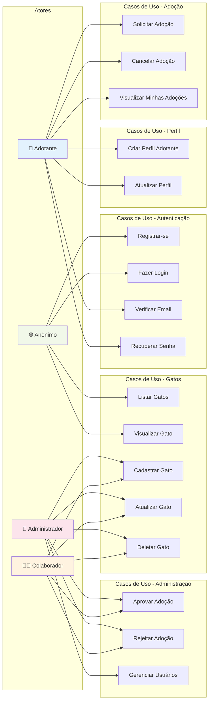

# Diagrama de Casos de Uso - SOS Gatinhos API

## Atores e Casos de Uso

## Matriz de Permissões

| Caso de Uso | Anônimo | Adotante | Colaborador | Admin |
|------------|---------|----------|-------------|-------|
| Registrar-se | ✅ | - | - | - |
| Fazer Login | ✅ | ✅ | ✅ | ✅ |
| Listar Gatos | ✅ | ✅ | ✅ | ✅ |
| Visualizar Gato | ✅ | ✅ | ✅ | ✅ |
| Cadastrar Gato | ❌ | ❌ | ✅ | ✅ |
| Atualizar Gato | ❌ | ❌ | ✅ | ✅ |
| Deletar Gato | ❌ | ❌ | ✅ | ✅ |
| Solicitar Adoção | ❌ | ✅ | ❌ | ❌ |
| Cancelar Adoção | ❌ | ✅ | ❌ | ✅ |
| Aprovar Adoção | ❌ | ❌ | ✅ | ✅ |
| Rejeitar Adoção | ❌ | ❌ | ✅ | ✅ |
| Criar Perfil | ❌ | ✅ | ❌ | ❌ |
| Gerenciar Usuários | ❌ | ❌ | ❌ | ✅ |

## Descrição dos Casos de Uso Principais

### UC10: Solicitar Adoção
- **Ator**: Adotante
- **Pré-condições**: Usuário autenticado, gato disponível
- **Fluxo Principal**:
  1. Adotante visualiza gato disponível
  2. Adotante clica em "Solicitar Adoção"
  3. Sistema cria registro de adoção com status PENDING
  4. Sistema notifica colaboradores/admin
- **Pós-condições**: Adoção criada, gato continua disponível até aprovação

### UC15: Aprovar Adoção
- **Ator**: Colaborador ou Admin
- **Pré-condições**: Adoção com status PENDING existe
- **Fluxo Principal**:
  1. Colaborador/Admin visualiza solicitações pendentes
  2. Avalia perfil do adotante
  3. Aprova a adoção
  4. Sistema muda status do gato para ADOPTED
  5. Sistema notifica adotante
- **Pós-condições**: Adoção aprovada, gato marcado como adotado

### UC7: Cadastrar Gato
- **Ator**: Colaborador ou Admin
- **Pré-condições**: Usuário autenticado com role adequada
- **Fluxo Principal**:
  1. Colaborador/Admin preenche formulário com dados do gato
  2. Sistema valida dados
  3. Sistema cria registro do gato
  4. Sistema retorna gato criado
- **Pós-condições**: Gato cadastrado com status AVAILABLE

