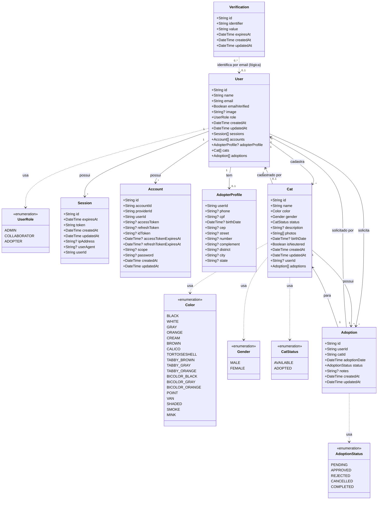

# Diagrama de Classe - SOS Gatinhos API

## Legenda

- **+** = atributo público
- **?** = atributo opcional (nullable)
- **[]** = array/lista
- **1** = um
- **0..1** = zero ou um (opcional)
- **\*** = muitos

## Relacionamentos

1. **User → Session**: Um usuário pode ter múltiplas sessões (1:N)
2. **User → Account**: Um usuário pode ter múltiplas contas (1:N)
3. **User → AdopterProfile**: Um usuário pode ter um perfil de adotante (1:0..1)
4. **User → Cat**: Um usuário pode cadastrar múltiplos gatos (1:N)
5. **User → Adoption**: Um usuário pode fazer múltiplas solicitações de adoção (1:N)
6. **Cat → Adoption**: Um gato pode ter múltiplas adoções (1:N)
7. **Adoption → User**: Uma adoção pertence a um usuário (N:1)
8. **Adoption → Cat**: Uma adoção é para um gato (N:1)
9. **Verification → User**: Relação lógica através do campo `identifier` (geralmente email). Não há foreign key, permitindo tokens antes do usuário existir (ex: durante registro)
