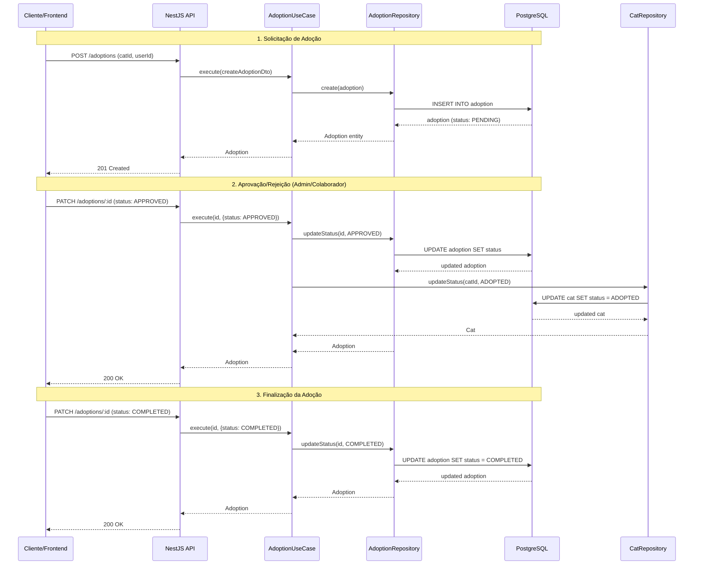
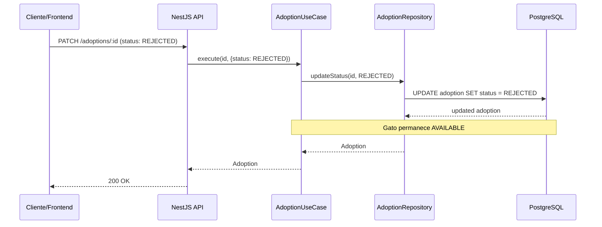
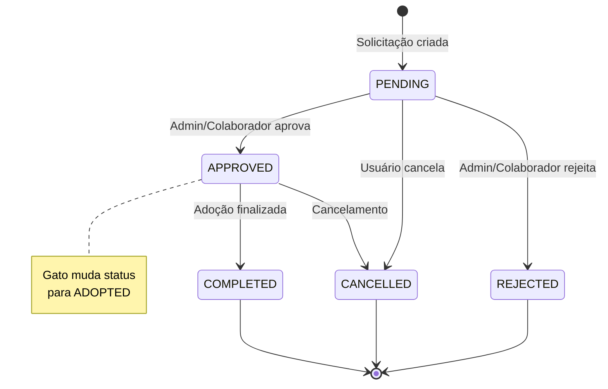

# Diagrama de Sequência - Processo de Adoção

## Fluxo Completo de Adoção

## Fluxo Alternativo: Rejeição

## Estados da Adoção

## Regras de Negócio

1. **PENDING**: Estado inicial quando uma adoção é solicitada
2. **APPROVED**: Apenas ADMIN ou COLLABORATOR podem aprovar
   - Quando aprovada, o gato muda status para ADOPTED
3. **REJECTED**: Apenas ADMIN ou COLLABORATOR podem rejeitar
   - Gato permanece AVAILABLE
4. **COMPLETED**: Adoção finalizada com sucesso
5. **CANCELLED**: Pode ser cancelada pelo usuário ou admin

